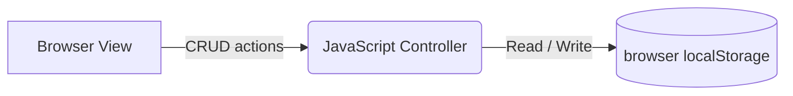

# Static Delivery Tracker - System Design

A beginner-friendly, static single-page application (SPA) that runs entirely inside the user's browser.

## Architecture Diagram

## Architecture Details
1. **Frontend**: Standard HTML, vanilla CSS (for simple styling), and basic inline JavaScript.
2. **Database (Local Storage)**: All delivery orders are stored locally in the browser's `localStorage` as serialized JSON data.
3. **No Backend**: The app does not require a web server, Python environment, or external APIs. It runs directly by launching the `index.html` file.
